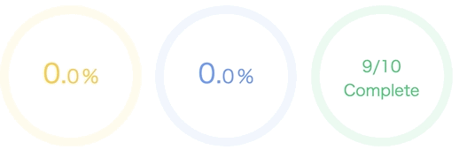
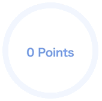

# progress-ring-component-react

[](https://badge.fury.io/js/progress-ring-component-react)
![Built With Stencil](https://img.shields.io/badge/-Built%20With%20Stencil-16161d.svg?logo=data%3Aimage%2Fsvg%2Bxml%3Bbase64%2CPD94bWwgdmVyc2lvbj0iMS4wIiBlbmNvZGluZz0idXRmLTgiPz4KPCEtLSBHZW5lcmF0b3I6IEFkb2JlIElsbHVzdHJhdG9yIDE5LjIuMSwgU1ZHIEV4cG9ydCBQbHVnLUluIC4gU1ZHIFZlcnNpb246IDYuMDAgQnVpbGQgMCkgIC0tPgo8c3ZnIHZlcnNpb249IjEuMSIgaWQ9IkxheWVyXzEiIHhtbG5zPSJodHRwOi8vd3d3LnczLm9yZy8yMDAwL3N2ZyIgeG1sbnM6eGxpbms9Imh0dHA6Ly93d3cudzMub3JnLzE5OTkveGxpbmsiIHg9IjBweCIgeT0iMHB4IgoJIHZpZXdCb3g9IjAgMCA1MTIgNTEyIiBzdHlsZT0iZW5hYmxlLWJhY2tncm91bmQ6bmV3IDAgMCA1MTIgNTEyOyIgeG1sOnNwYWNlPSJwcmVzZXJ2ZSI%2BCjxzdHlsZSB0eXBlPSJ0ZXh0L2NzcyI%2BCgkuc3Qwe2ZpbGw6I0ZGRkZGRjt9Cjwvc3R5bGU%2BCjxwYXRoIGNsYXNzPSJzdDAiIGQ9Ik00MjQuNywzNzMuOWMwLDM3LjYtNTUuMSw2OC42LTkyLjcsNjguNkgxODAuNGMtMzcuOSwwLTkyLjctMzAuNy05Mi43LTY4LjZ2LTMuNmgzMzYuOVYzNzMuOXoiLz4KPHBhdGggY2xhc3M9InN0MCIgZD0iTTQyNC43LDI5Mi4xSDE4MC40Yy0zNy42LDAtOTIuNy0zMS05Mi43LTY4LjZ2LTMuNkgzMzJjMzcuNiwwLDkyLjcsMzEsOTIuNyw2OC42VjI5Mi4xeiIvPgo8cGF0aCBjbGFzcz0ic3QwIiBkPSJNNDI0LjcsMTQxLjdIODcuN3YtMy42YzAtMzcuNiw1NC44LTY4LjYsOTIuNy02OC42SDMzMmMzNy45LDAsOTIuNywzMC43LDkyLjcsNjguNlYxNDEuN3oiLz4KPC9zdmc%2BCg%3D%3D&colorA=16161d&style=flat-square)

This is a React version of [progress-ring-component](https://github.com/taisuke-j/progress-ring-component), an animated web component showing progress in percentage. It internally uses [easing-animation-frames](https://github.com/taisuke-j/easing-animation-frames)  library to create CPU-friendly easing animations and compiled with [Stencil](https://stenciljs.com/) and its [React wrapper library](https://github.com/ionic-team/stencil-ds-output-targets).



```tsx
<ProgressRing percentage={30} />
<ProgressRing percentage={60} round-linecap={true} />
<ProgressRing percentage={90} disable-digits={true}>
  <p class="completed-count">9/10<br />Complete</p>
</ProgressRing>
```

There is only one mandatory property, `percentage`, which declares the ending percentage in animation. You can also use `radius` prop to change the size of the ring, and `storkeWidth` to change the thickness of the ring. The full list of properties can be found below.

This component works reactively in a unidirectional fashion. When the `percentage` changes, it stops the current animation and resumes it with new percentage. There is pre-defined color scheme (`red (< 25%)` -> `yellow (< 50%)` -> `blue (< 75%)` -> `green (>= 75%)`).

### Properties

| Property         | Type    | Default                                                             | Description                                 |
| ---------------- | ------- | ------------------------------------------------------------------- | ------------------------------------------- |
| percentage       | number  | 0                                                                   | Percentage value (mandatory)                |
| radius           | number  | 80                                                                  | Radius of the ring                          |
| stroke-width     | number  | 10                                                                  | Thickness of the ring                       |
| round-linecap    | boolean | false                                                               | Addes rounded linecap to the ring           |
| duration         | number  | 4000                                                                | Animation duration in miliseconds           |
| easing-type      | string  | "quartInOut"                                                        | Easing animation function name              |
| int-size         | number  | 30                                                                  | Font size of integer                        |
| decimal-size     | number  | intSize \* 0.7                                                      | Font size of decimals                       |
| disable-digits   | boolean | false                                                               | Hides digits                                |
| disable-decimals | boolean | false                                                               | Hides decimal places                        |
| colors           | Map  | `[[0,"#ff4f40"],[25, "#ffcd40"],[50, "#66a0ff"],[75, "#30bf7a"]]` | Color steps with percentage and color code  |
| invert-colors    | boolean | false                                                               | Inverts the color scheme                    |
| event-id         | string  | undefined                                                           | Event Id to be used for animation callbacks |

#### Easing Types

`backInOut`, `backIn`, `backOut`, `bounceInOut`, `bounceIn`, `bounceOut`, `circInOut`, `circIn`, `circOut`, `cubicInOut`, `cubicIn`, `cubicOut`, `elasticInOut`, `elasticIn`, `elasticOut`, `expoInOut`, `expoIn`, `expoOut`, `linear`, `quadInOut`, `quadIn`, `quadOut`, `quartInOut`, `quartIn`, `quartOut`, `quintInOut`, `quintIn`, `quintOut`, `sineInOut`, `sineIn`, `sineOut`

### Advanced usage with animation events

By passing `even-id` as a prop, you can listen to events emitted by with the animation, and register callback functions for them.



| Event Name  | Payload                                                | Description                                                |
| ----------- | ------------------------------------------------------ | ---------------------------------------------------------- |
| prcProgress | `{ id: string, progress: number, percentage: number }` | Event to be emitted on every progress change (from 0 to 1) |
| prcStart    | `{ id: string }`                                       | Event to be emitted when the animation starts              |
| prcComplete | `{ id: string }`                                       | Event to be emitted when the animation is completed        |
| prcStop     | `{ id: string }`                                       | Event to be emitted when the animation is stopped          |
| prcResume   | `{ id: string }`                                       | Event to be emitted when the animation is resumed          |
| prcRestart  | `{ id: string }`                                       | Event to be emitted when the animation is restarted        |